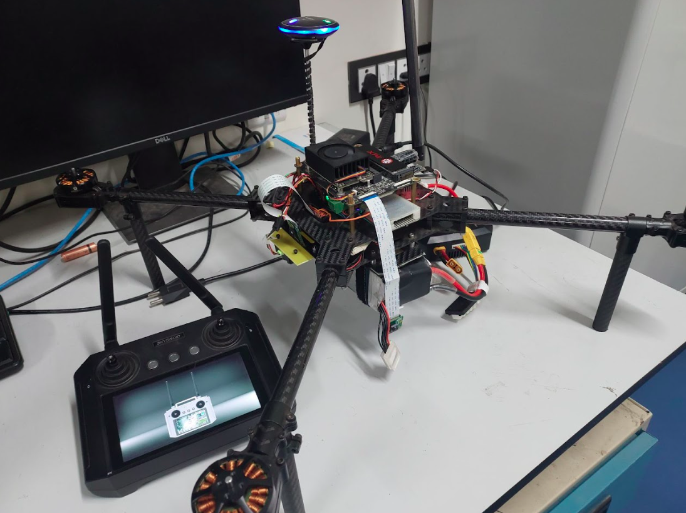
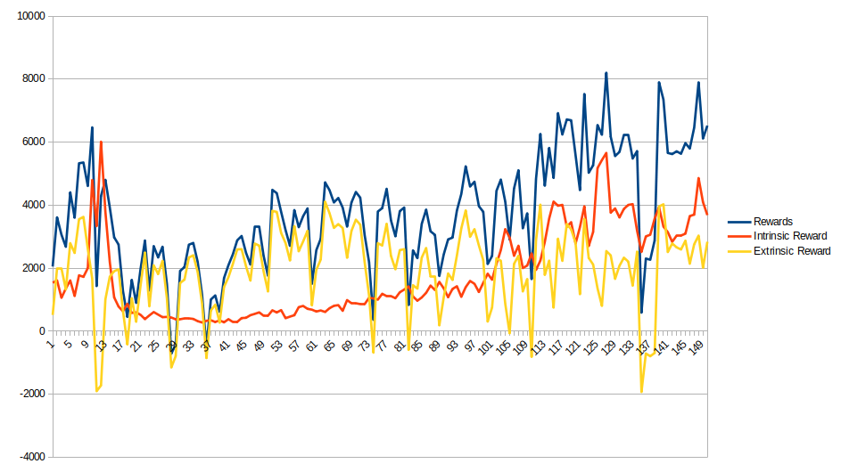

# Experiments on RL techniques for Navigation & Exploration on UAVs

### About

This repository contains the code and experiments performed for various RL techniques for UAV navigation and exploration in unknown indoor environments. The long term goal focuses on leveraging low-resolution RGB input for the UAV's actor model, while feeding various sensor data (e.g., LiDAR, IMU, RGB camera, global positioning data) to multiple critics. This approach enables more efficient navigation by combining different perspectives on the environment through multiple critics while relying solely on vision for the decision-making actor.


##### Contributors
   - [Ritwik Sharma](https://github.com/Maker-Rat)
   - [Vimarsh Shah](https://vimarsh244.github.io)

[**Technical Report**](others/Final_Report_PS.pdf)



### Experiments

We tested multiple reinforcement learning (RL) algorithms, including Proximal Policy Optimization (PPO), Soft Actor-Critic (SAC), and Deep Deterministic Policy Gradient (DDPG) in a Gazebo-based environment over 150 episodes. More details in the report. 

Additionally, we integrated an Intrinsic Curiosity Module (ICM) with PPO, aimed at improving exploration in sparse-reward environments by generating intrinsic rewards based on the agent’s ability to predict its environment interactions.

#### Initial Results

    PPO: Outperformed SAC and DDPG, demonstrating stable and efficient learning with minimal reward oscillations.
    SAC: Showed significant reward oscillations and instability in learning.
    DDPG: Performed better than SAC but exhibited more oscillations than PPO.


When integrating ICM with PPO, we observed that intrinsic rewards gradually aligned with extrinsic rewards, improving exploration efficiency. After hyperparameter tuning, ICM helped the agent learn the environment faster, demonstrating significant improvements in performance over traditional methods.



### Reward Structure

1. **Extrinsic Rewards:**
   - **Avoiding Potential Fields (APF):** A penalty of `-0.075` was applied for moving into high-potential fields, which correspond to obstacles or undesirable regions.
   - **Entropy Bonus:** A small bonus for ensuring diversity in actions, encouraging exploration.
   - **Spinnage Penalty:** A penalty inversely proportional to the robot's angular velocity, penalizing excessive spinning to ensure efficient movement.

   ```math
   \text{Total Reward} = -0.075 \cdot \text{APF} + \text{Entropy} + \frac{1}{1 + \text{Spinnage}}
   ```

2. **Intrinsic Rewards (ICM):**
   Intrinsic rewards were calculated using the **Intrinsic Curiosity Module (ICM)**:
   - The **forward model** predicted the next state based on the current state and action.
   - The intrinsic reward was proportional to the error between the predicted and actual next state features. This reward encouraged the agent to explore novel or poorly understood states.

   
```math
   r_{\text{intr}} = \text{scale} \times \frac{1}{2} \|f_{\text{feat}}(s') - \hat{f}_{\text{feat}}(s, a)\|^2
   ```

The combination of these rewards helped guide the agent to both explore efficiently (via ICM) and complete tasks effectively (via extrinsic rewards).

### Environment Setup

Our environment was built in **ROS Noetic** and simulated using **Gazebo**, designed to replicate real-world scenarios for UAV exploration tasks. We started with use of PX4 SITL simulation, but soon ran into challenges with compute and time requirements, so we simplified the problem with the use of turtlebot3.  We additionally used the [(modified) HouseExpo dataset](https://github.com/vimarsh244/HouseExpo) as the basis for generating environments.

We additionally also wrote a custom implementation of Grid Mapping as we found gmapping to be limitting our performance significantly.

   - The TurtleBot3 robot was set up in a ROS noetic + Gazebo was used as the simulation environment for testing exploration tasks. Custom world files based on real-world datasets and other available maze datasets were converted into Gazebo-compatible formats.
   - Each world was designed to feature a mix of narrow passages, large rooms offering a realistic testing ground for the agent.

This setup allowed us to test both traditional and curiosity-driven exploration in a realistic but controlled environment.

#### Further Work

ICM Refinement: Further testing is needed to evaluate the integration of intrinsic rewards into decision-making. Our preliminary results suggest rapid convergence with ICM, potentially allowing the agent to operate with little to no extrinsic rewards.

Architecture and Hyperparameters: Our current implementation might slightly differ from established frameworks like Stable Baselines. More extensive comparisons are necessary to isolate the improvements due to ICM alone.

More Training: We are currently working on migrating to other simulation engines - gym pybullet and nvidia isaac sim. The current gazebo setup makes it very difficult to train in parallel, this would allow us to do so.

Our original work on using Multulayered DDPG didn't result in massive improvements, but we believe the idea of multiple critics evaluating a value function, however with only single actor would greatly improve performance in low resource (and resolution) of sensors available on a drone.

### Acknowledgement

This work was part of the [PS1](https://www.bits-pilani.ac.in/practice-school/) program at [CSIR:CEERI](https://www.ceeri.res.in) under the guidance of [Dr. Kaushal Kishore](https://www.ceeri.res.in/profiles/kaushal-kishore/).
